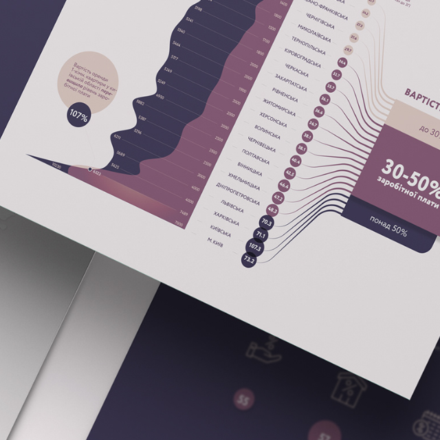

---
layout:post
title:About me
nav-menu: true
---
<!-- Main -->

<!-- One -->
<section id="one">
	

<!-- Content for  Button -->

<header class="major">
<h2>Education</h2>
</header>
				<table style="width:100%">
					<tr>
						<td style="text-align:center"></td>
						<td style="vertical-align:left"><b>Master of Science in Business Analytics</b> 
						August 2022 -  Present <i>University of Notre Dame, United States</i></td> 
					</tr>
					<tr>
						<td style="text-align:center"></td>
						<td style="vertical-align:left"><b>Economics and Management</b> 
						September 2021 -  January 2022 <i>University of Amsterdam, Netherlands</i></td> 
					</tr>					
				</table>

<header class="major">
<h2>Work Experience</h2>
</header>
				<table style="width:100%">
					<tr>
						<td style="text-align:middle"></td>
						<td style="text-align:left"><b>GroupM</b> 
						August 2022 -  Present <i>Programmatic Advertising Intern</i></td> 
					</tr>
					<tr>
						<td style="text-align:middle"></td>
						<td style="text-align:left"><b>Ipsos</b> 
						September 2021 -  January 2022 <i>Social Intelligence & Analytics Intern</i></td> 
					</tr>					
				</table>

		

<header class="major">
<h2>Skills</h2>
</header>
				<table style="width:100%">
					<tr>
						<td style="text-align:center"></td>
						<td style="text-align:left"><b>Data Visualization</b> 
						Tableau PowerBI</td> 
					</tr>
					<tr>
						<td style="text-align:center"></td>
						<td style="text-align:left"><b>Statistics</b> 
						R Programming STATA</td> 
					</tr>				
				</table>

	

 		

<a href="../assets/CV.pdf" class="button icon fa-download" target="_blank">Download CV</a>

	
</section>
